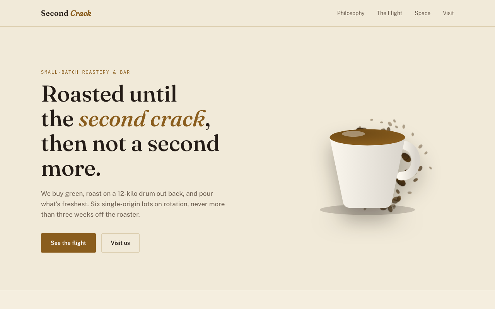
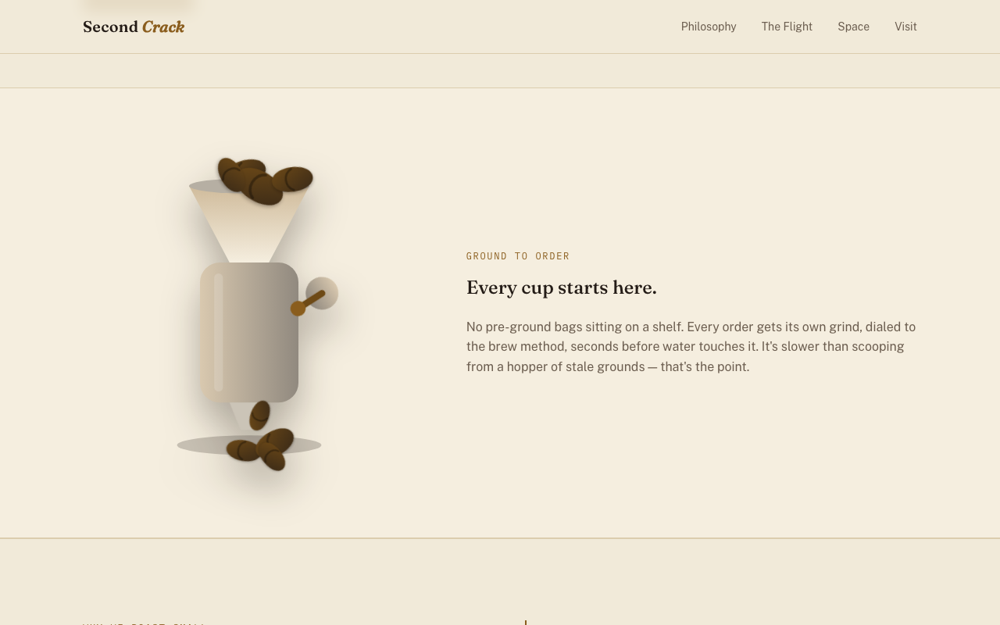
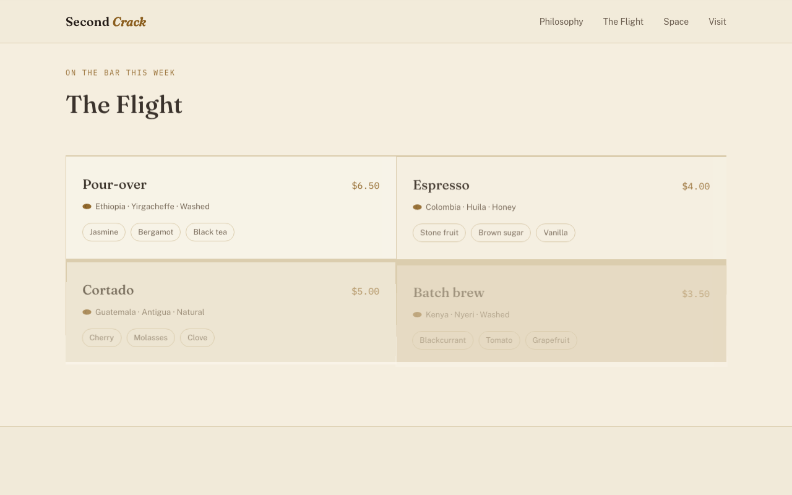

# Second Crack

A landing page concept for a boutique single-origin coffee roastery — built as a portfolio/demo piece.

**Live demo:** https://egor27riabokon-cmd.github.io/second-crack-coffee/

## What's in it

- Custom "soft 3D" illustrations (cup, scattered beans, grinder with a spinning crank) built with layered SVG gradients and shadows — no stock photos, no external assets.
- A palette and typography built around the roasting process itself: warm roast-brown tones, `Fraunces` for display type, `Public Sans` for body copy, `IBM Plex Mono` for prices and details.
- Full light/dark theme support, tuned separately for each.
- Scroll-reveal animations on menu cards and sections, all respecting `prefers-reduced-motion`.

## Stack

Single self-contained `index.html` — no build step, no dependencies. Fonts are pulled from Google Fonts; everything else (illustrations, animation, grain textures) is hand-rolled CSS/SVG/Canvas.
